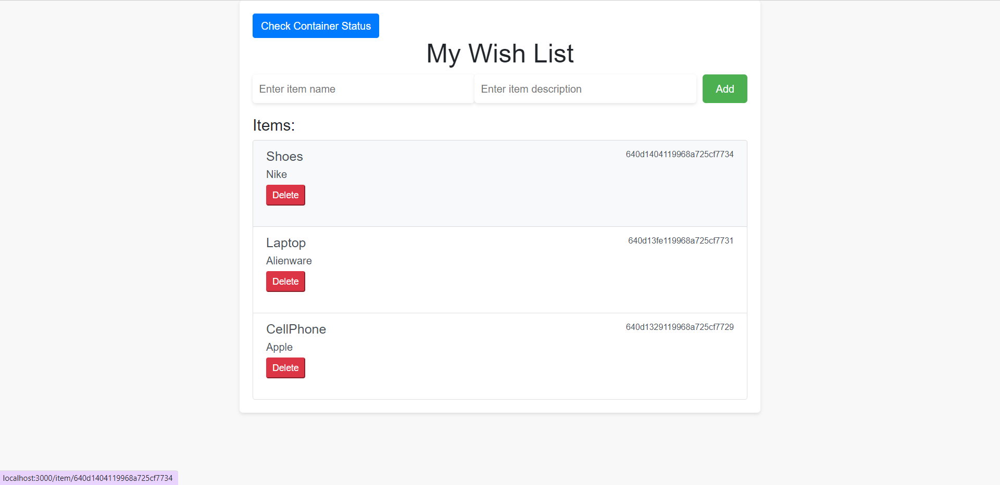

# Project Overview

This project is written in Node.js and docker, make sure you have these installed.

## Getting Started

To run this project, use the following command:

```
npm install
```

This will install all necessary packages that are used within this project.

Then, run the following command:

```
docker-compose up
```

If you are willing to make changes to the code and apply them to the images, you can use the following command:

```
docker-compose up --build
```

This allows you to build the program and start the program.

After the program starts running, go to http://localhost:3000/.

## Project Details

My project has a simple item model that contains a name and description, where the ID is auto-generated by mongoose, and it is also accessible by the frontend.

### API

The API includes:

- Get the item list and display it on the main page.
- Post a new item to the item list and display it immediately on the main page after it is added.
- Delete an item by ID and display the updated list on the main page after it is deleted.
- Get an individual item by ID. After clicking a certain item, it should redirect to a new page `/item/:id` and display the ID, name, and description for that item.
- Get container status in `/containers`. These pages should be able to return the current states for both running containers.

### Work in Progress

The following features are currently being worked on:

- Use Terraform to start and stop the Mongo DB container and have the server invoke Terraform instead of Docker directly.
- Use AWS to deploy the server and make it run on the cloud.

### Preview



